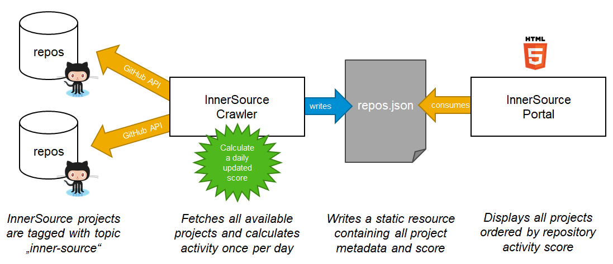

# GitHub Profiler

Project Portal for implementing Shift Left Security and [InnerSource portal pattern](https://github.com/InnerSourceCommons/InnerSourcePatterns/blob/master/patterns/2-structured/innersource-portal.md) by the [InnerSource Commons community](http://innersourcecommons.org/).

Profiles all InnerSource GitHub projects of a company in an interactive and easy to use way for Shift Left Security  Adoption

## Description

Each tile in the project portal represents an InnerSource project.
The list of projects can be filtered by programming language, sorted by various KPIs, and searched using a keyword.
Filter and search criterias are persisted in the URL to allow sharing a subset of projects easily. Entries in the portal can be sorted by the [Repository Activity Score](https://github.com/InnerSourceCommons/InnerSourcePatterns/blob/master/patterns/2-structured/repository-activity-score.md).


## Development Environment


1. Fork and clone this repository

1. Refer [SLS.md](./SLS.md) for setting up Visual Studo Code [Remote Containers](https://marketplace.visualstudio.com/items?itemName=ms-vscode-remote.remote-containers) extension and use docker as a full-featured development environment.

1. Run the project portal on a local web server

``` shell script
react-scripts start
```

> *Note:* a browser window will open automatically

4. Start developing!

## Configuration

The portal uses a static ```repos.json``` file with mock data for testing and developing purposes. In a productive environment, consider adding an automated crawler script that fetches all InnerSource projects as outlined in the following picture:



To do so, apply the following steps:

1. Crawl all projects with the topic `inner-source` in your GitHub instance using the [GitHub search API](https://developer.github.com/v3/search/):

   ```
   ?q=topic:inner-source
   ```

   The API returns a list of projects with essential information like name, avatar, description, and statistics that we can enrich with additional fields.

   > *Note:* You can optionally limit the result set by adding `is:public` or `is:private` to the query, depending on how InnerSource repositories are characterized in your environment.

2. For each resulting project add a key ```_InnerSourceMetadata``` to the result from the GitHub API call and fill it with additional metadata about the project:

   * Check if there is a file ```innersource.json``` in the repository and add all keys directly below ```_InnerSourceMetadata```.

   * Query GitHub for the [weekly commit count](https://docs.github.com/en/free-pro-team@latest/rest/reference/repos#get-the-weekly-commit-count) (subset "all") and add it with the key `participation`

   * (Optional) Check if there are contribution guidelines and add the file name with the key `guidelines` (e.g. `CONTRIBUTING.md`). If specified, the *Contribute* button will link directly to the file instead of the repository root.

   * (Optional) Query GitHub [topics](https://docs.github.com/en/rest/reference/repos#get-all-repository-topics) and add the array of topics with the key `topics` for each repo to allow searching projects by topic and displaying them on the detail popup.

   * (Optional) Calculate the [Repository Activity Score](https://github.com/InnerSourceCommons/InnerSourcePatterns/blob/master/patterns/2-structured/repository-activity-score.md) to define a meaningful order for the projects. Sort entries by score descending. Add it with the key `score`

3. Write the resulting list of projects with all metadata to the file ```repos.json``` to serve all projects in the portal.

With this approach, projects can self-register to the portal by adding the ```inner-source``` topic to their repository and specifying additional metadata inside an ```innersource.json``` file.
For more information about this file, see [Listing Project in the Project Portal for InnerSource](CONTRIBUTING.md#listing-project-in-the-project-portal-for-innersource)


## Contributing

This project started as an InnerSource project at SAP and is now open source. Your contributions are welcome!
Please check our [contributing guidelines](.github/CONTRIBUTING.md) for more details.

## Thirdparty

We use the following open source frameworks to create the portal:
* [Reactjs](https://reactjs.org/)
* [Materialize](https://materializecss.com/)
* [Material-Icons](https://www.npmjs.com/package/material-icons)
* [Moment.js](https://momentjs.com/)
* [Seedrandom](https://github.com/davidbau/seedrandom)

## Acknowledgements

Thanks to
* [InnerSourceCommons Pattern Group](https://github.com/InnerSourceCommons/InnerSourcePatterns)
* [SAP Project Portal For Innersource](https://github.com/SAP/project-portal-for-innersource)
* [Shift Left Security Adoption](https://github.com/rajasoun/cookiecutter-shift-left-security)
